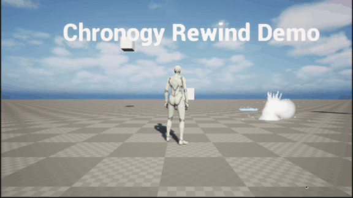

# UE5-RewindPlugin

A fully featured extendable time rewinding plugin for Unreal Engine 5 built on top of the Gameplay Ability System. 
Is memory efficient by design and supports rewinding any number of objects, animations, and custom properties with minimal setup.

>Originally inspired by [NU Makes Games' time rewind system](https://github.com/NuMakesGames/ue5-rewind), rebuilt from scratch as a decoupled plugin.

---

## Features

**GAS Integration:** 
All rewind actions are implemented as GAS-compatible Gameplay Abilities, giving you built-in support for cooldowns and activation conditions. The plugin currently runs locally (single-player); building on GAS keeps it well positioned for replication, but networked rewind is not implemented yet.

**Decoupled Architecture**
No tight coupling to any actors or components, you can drop it into any project without modification.

**Broad Rewind Coverage**
A single component records and reverses far more than position:
- Transform, Physics Velocity, and Movement Mode
- Skeletal Animation Via Bone-Pose Snapshots
- Light Intensity and Color
- Material Scalar and Vector Parameters (on an auto-created dynamic material instance)
- Niagara Particle Systems

**Niagara Particle Rewind**
Niagara has no native way to run backward, so systems are reversed by driving their age from the rewind clock. 
Three strategies are supported: 
- **Scrub** (true reverse for short deterministic bursts)
- **FollowTransform** (for motion-trail/ribbon effects that reverse naturally with the moving owner)
- **Freeze** (a robust fallback for GPU, looping, or non-deterministic systems)

**Plugin Interface**
A clean and extensible API for registering new rewindable components with minimal boilerplate.
>**Note:** Some assets require different implementations such as animation rewinding requiring its own interface, please refer to the [documentation](Documentation.md) for specifics.

## Features in Progress:

**Editor Utility Widget:**
The process for making a destructible rewind object is painful due to having to manually split the object and assign each part. Working on an automated solution.

**Automated Testing Tools:**
There is a debugging suite, but it is done mostly through logs with no automated testing increasing the likelihood of user error.

**Merging Animation and Skeletal Mesh Budget Cap**
Currently, the animation and skeletal mesh each have their own individual memory budget adding up to 4 MB. This is unintended, and increases the allocation by 2mb for skeletal objects! While you should never hit this cap, it is worth a fix.

---

## Requirements

- Unreal Engine 5.x
- Gameplay Ability System (GAS) enabled and configured in your project
> **GAS must be set up before installing this plugin.** If you haven't done this yet, see Epic's [GAS documentation](https://docs.unrealengine.com/5.0/en-US/gameplay-ability-system-for-unreal-engine/) before continuing.
 
---

## Installation

1. Download the Plugins Folder
2. Place inside C:..../YourUnrealEngineProject
3. Regenerate project files
4. Rebuild manually from source
5. Enable the plugin and restart the editor

### Note: A Demo Is Provided should one clone the whole folder as a project

---

### For A More Detailed Explanation See [Documentation](Documentation.md)

